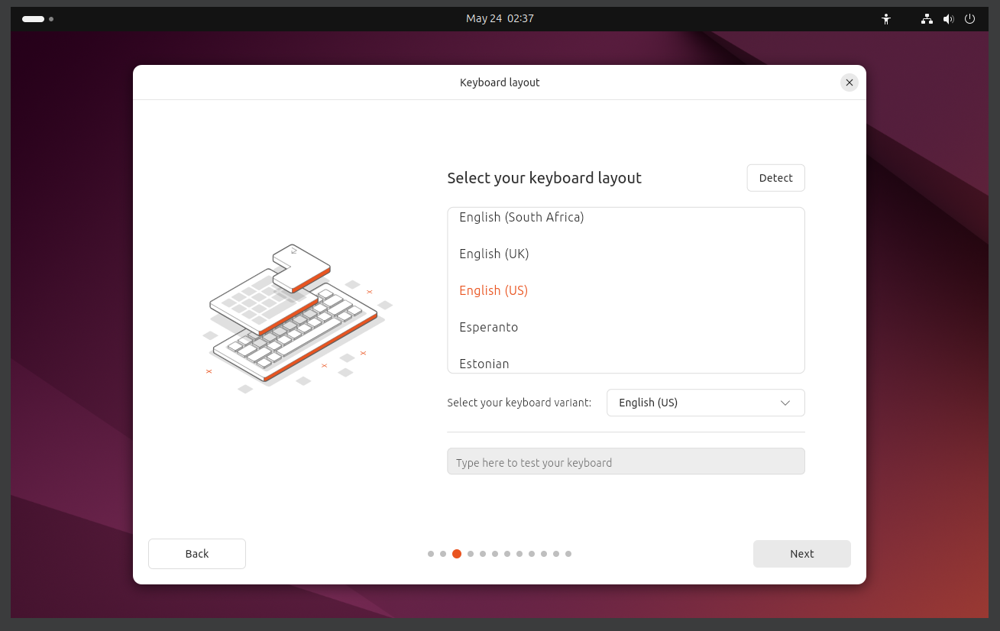
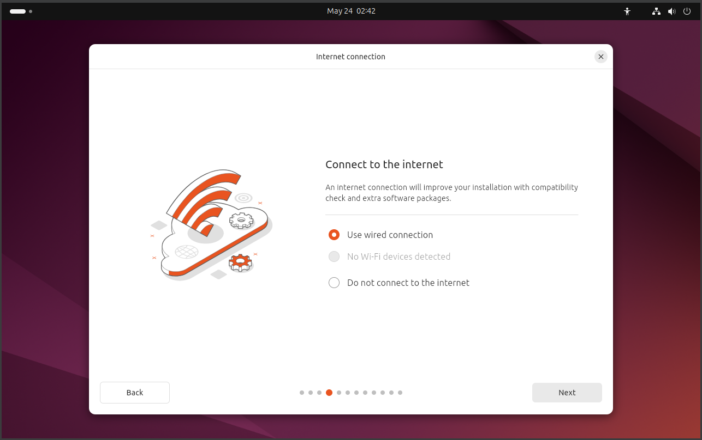
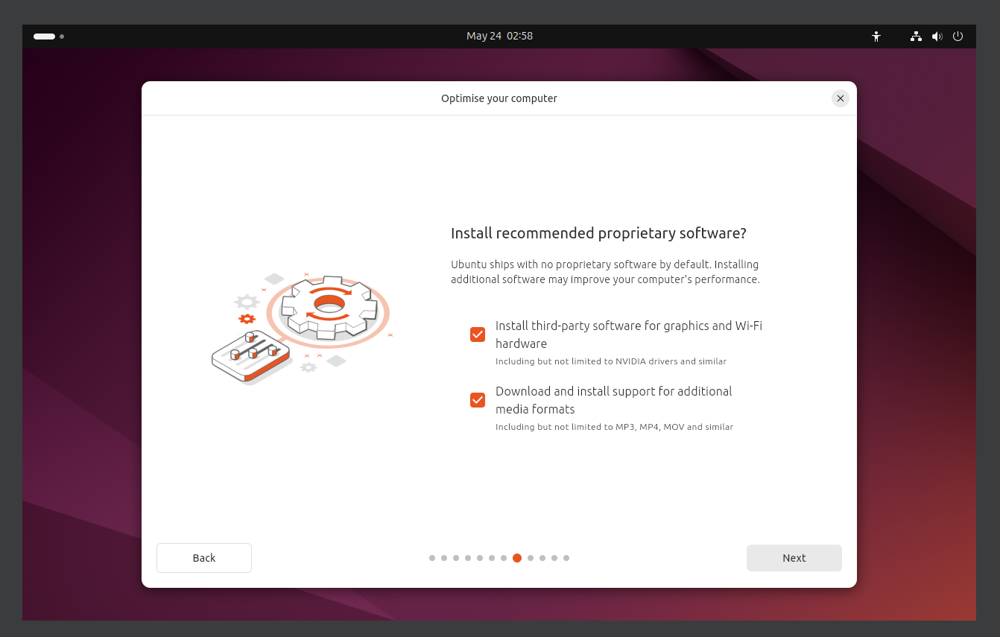
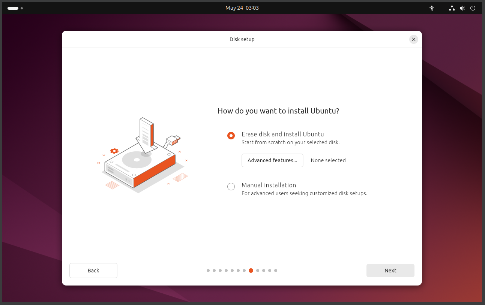
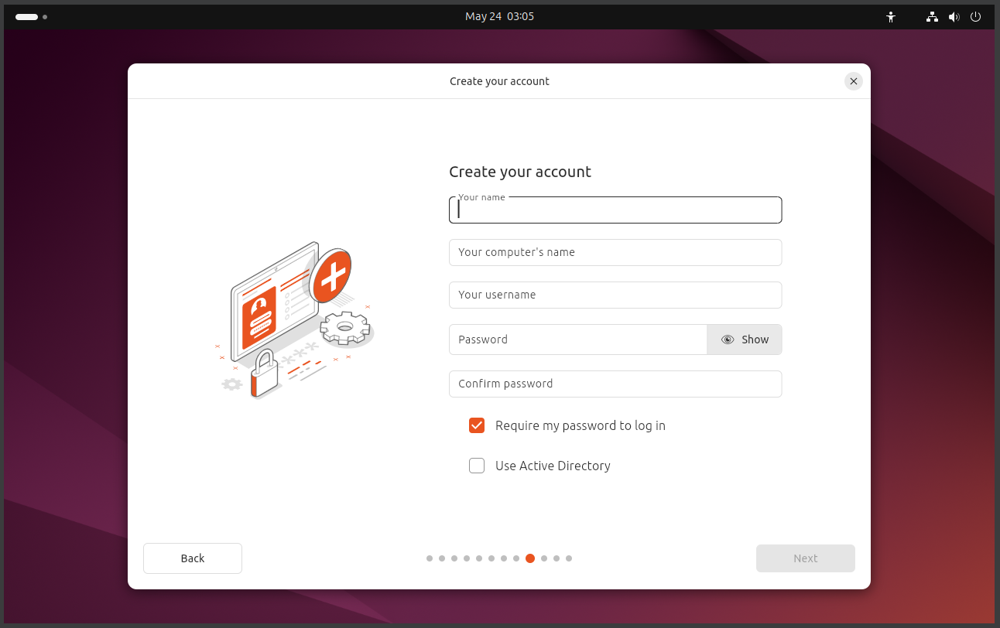
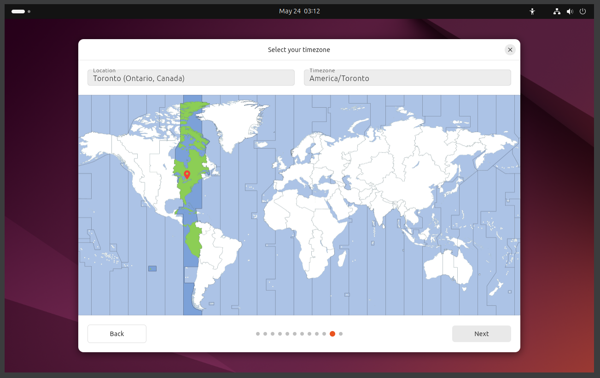
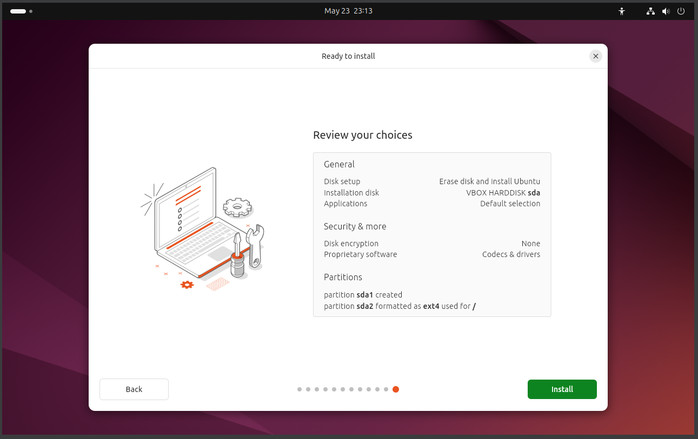
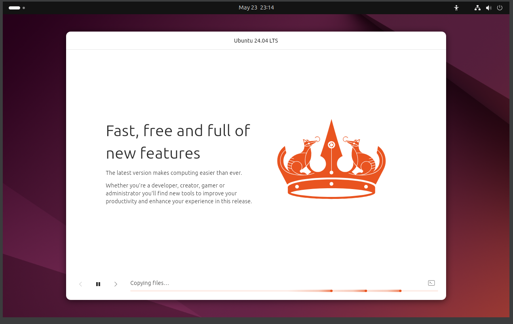
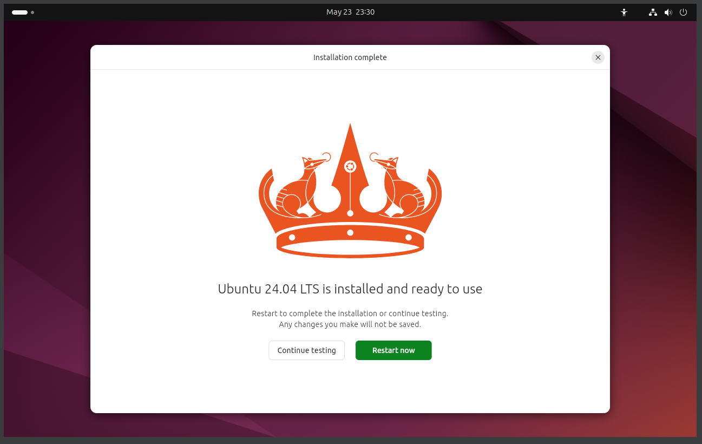

= Ubuntu Installation Guide 
MACH Software Team
v1.0, 2024-05-23
:docinfo: shared

== Introduction

== Step 1: Booting from USB
When booting from USB, make sure to have a full ISO image on a reliable (preferably fast) USB drive.

For ubuntu, you should grab an ISO of your choice __(I recommend an LTS version)__ from the Ubuntu Releases website https://releases.ubuntu.com/[here]

Enter your system BIOS, and select boot from USB (this process differs between hardware manufacturers).

== Step 2: Selecting Installation Option
Once your system restarts and turns on, you should be left at this screen.

You can try any of the options yourself, but for this case specifically, select *Try or Install Ubuntu*.

image::ubuntu-installation-images/grub-boot.png[Boot Screen]

== Step 3: Choosing Language & Keyboard Layout
Now that you've booted into the disk image, you should see the install wizard.

Please follow the sequence of images, if you encounter a screen not shown, skip past it.

image::ubuntu-installation-images/language-selection.png[Install Wizard Screen]

== Step 4: Installation Settings

=== Part 1: Network Configuration
Your first step is configuring your network, I usually use ethernet so I don't have an issue setting up Wi-Fi. If you wish to set up Wi-Fi, you will likely encounter a screen that requires multiple fiields to fill in, including but not limited to:

.Wi-Fi Settings Options
[options="header"]
|=======
| Field Name | Potential Values 
|Wireless Security  | WPA/WPA2 and if on University networks, WPA2 Enterprise
| Authentication    | Protected EAP (PEAP)
| Anonymous Identity | left blank
| CA Certificate     |If unavailable, select NO CERTIFICATE
| Username          | Your Wifi Username if applicable
| Password          | Your Wifi Password if applicable
|=======

=== Part 2: Try or Install
You will face the Try or Install Ubuntu screen, and this is where you should hit *Install Ubuntu*.

image::ubuntu-installation-images/try-or-install-selection.png[Install Ubuntu Selection]

=== Part 3: Application Selection
If you need fancy extra applications (I usually prefer to install those myself), click *Extended Selection*. Otherwise, click *Default Selection*.

image::ubuntu-installation-images/apps-selection.png[Default Selection]

=== Part 4: Proprietary Software Selection
I would check all the options here, as video formats and drivers are not something most people want to troubleshoot themselves, and this small step saves a lot of future headaches.

Now you just wait for the changes to be applied!

== Step 5: Partitioning

=== Manual vs. Automatic Partitioning
If attempting to dual boot, manual partitioning will help you in specifying specific volume sizes so that Ubuntu doesn't eat up your operating system.

However, this guide is about installing Ubuntu on its own, and so we do Automatic Partitioning by erasing the disk and starting from scratch.

Do not select any advanced features (i.e encryption) for MACH computers, as we will be unable to read the filesystem should any error occur at any time.

== Step 6: Creating a User Account

.User Account Options
[options="header"]
|=======
| Field Name | Value | Purpose 
| Your Name  | MACH |Mostly Cosmetic, just for display
| Your Computer's Name    | gremlin (or whatever) | Computer Host Name
| Your username | mach | Local User Name
| Password     | (come up with a good password) |Account Password
| Confirm Password          | (type it again) | Confirmation Field
| Require my Password to Log In          | (always checked) | Checkbox
| Use Active Directory | (always unchecked ) |Group Management Checkbox
|=======

== Step 7: Geographic Location and TimeZone
This should be auto-selected, but if not you can manually select it.

== Step 8: Installation

Your system should be ready to install! Hit *Install* when you're ready to proceed.

=== Part 1: Progress

This might take a while depending on your hardware, so sit tight and relax while Ubuntu installs itself to your system.

=== Part 2: Completion

Once you've reached this point, just hit restart now and your system will be ready to go!

